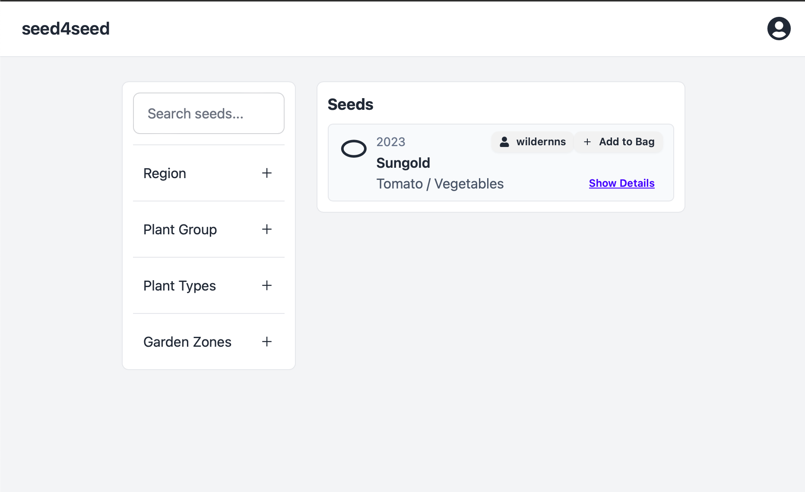
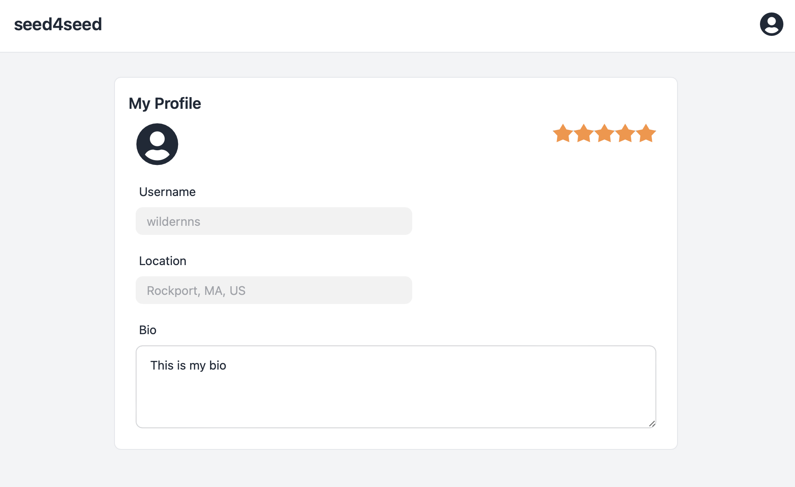
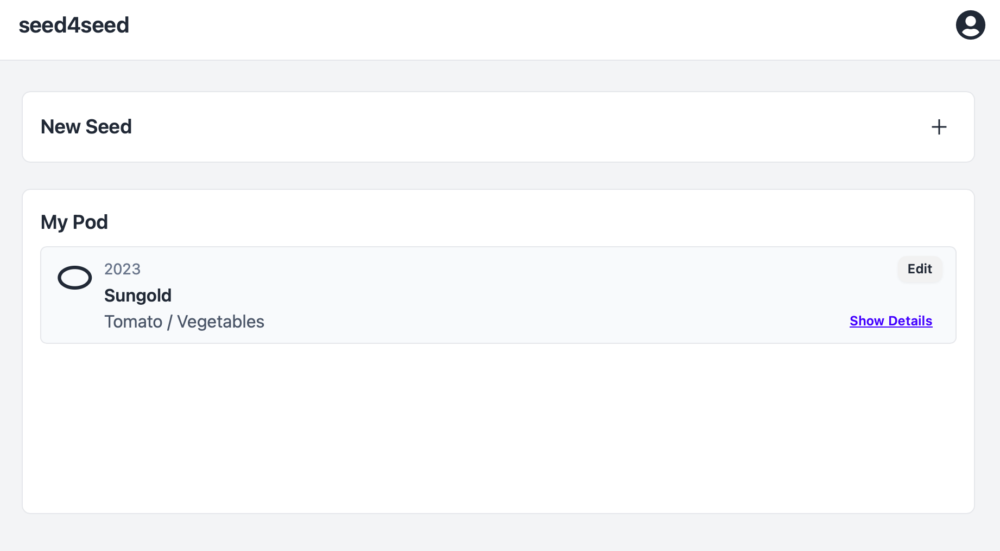
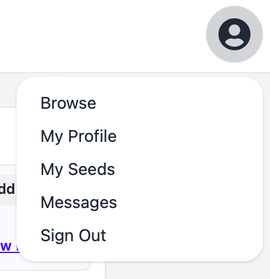

# Seed4Seed Trading Web Application

Welcome to Seed4Seed! This is a platform that will enable users to trade seeds seamlessly, backed by a trust-based rating system that helps ensure quality seeds and secure trades in the seed trading community. 

## Features

- (IP) **User Authentication**: Users can sign up, log in, and log out securely.
- (IP) **Seed Listings**: Users can create listings for the seeds they have available for trading, including details such as seed type, quantity, and desired seeds in exchange.
- (IP) **Search and Filter**: Users can search for specific seeds or filter seeds based on various criteria.
- (IP) **Messaging System**: Users can communicate with each other to negotiate trades using an integrated messaging system.
- (IP) **Trade Management**: Users can manage their trades, including accepting, rejecting, or negotiating trade offers.

## Tech Stack

- **Styling**: Styled using Tailwind CSS for a modern and customizable design.
- **Frontend**: Built using ReactJS, providing a responsive and dynamic user interface.
- **Backend**: Powered by Flask, a lightweight Python web framework, serving as the API endpoint.
- **Database**: Will utilize both PostgreSQL and MongoDB databases.
  - PostgreSQL is used for structured data storage, such as user authentication details and transaction data.
  - MongoDB is used for storing data like messages, seed listing attributes, and seller page attributes.

## Demo Update 3/19/24
### Page: ./browse  

### Page: ./myprofile  

### Page: ./myseeds

### Feature: Navigation Bar

## License

All Rights Reserved

This project is licensed under the "All Rights Reserved" license. You are not allowed to use, distribute, or modify the code without explicit permission from the owner.

## Acknowledgements

- We extend our gratitude to the creators of ReactJS, Tailwind CSS, Flask, GraphQL, PostgreSQL, and MongoDB for providing excellent tools and technologies.

Thank you for checking out our Seed Trading Web Application! If you have any questions or feedback, feel free to reach out to us. Happy trading! 🌱🌿

- Nick Schaefer & Natalie Salazar 
